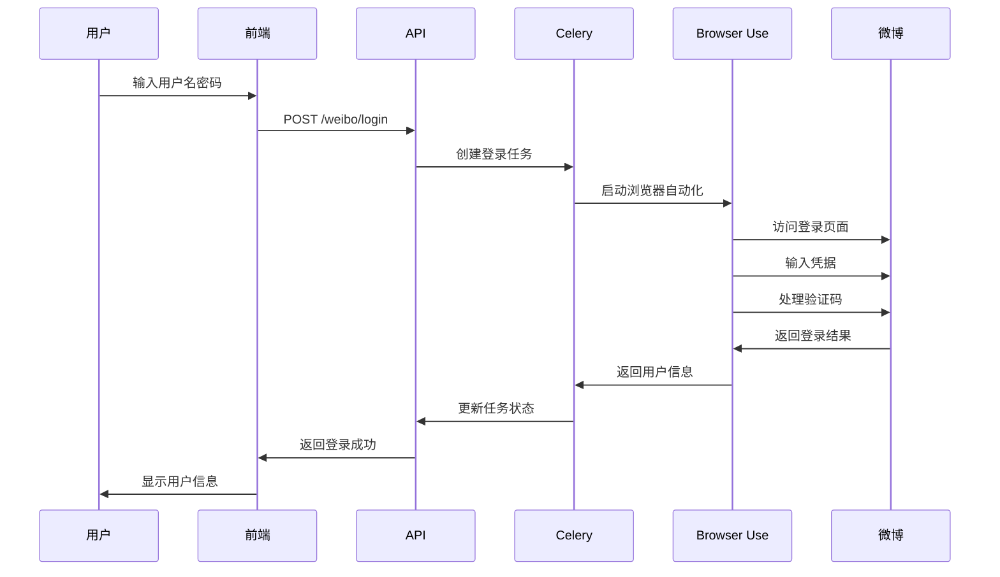
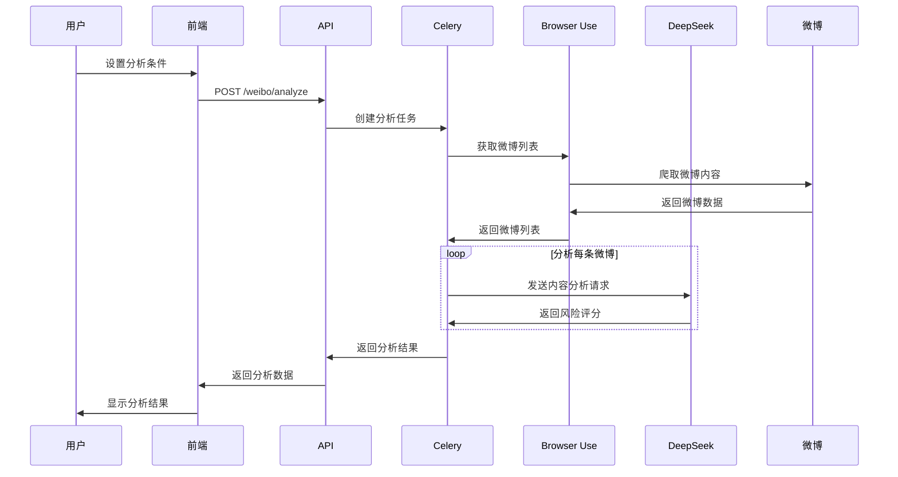
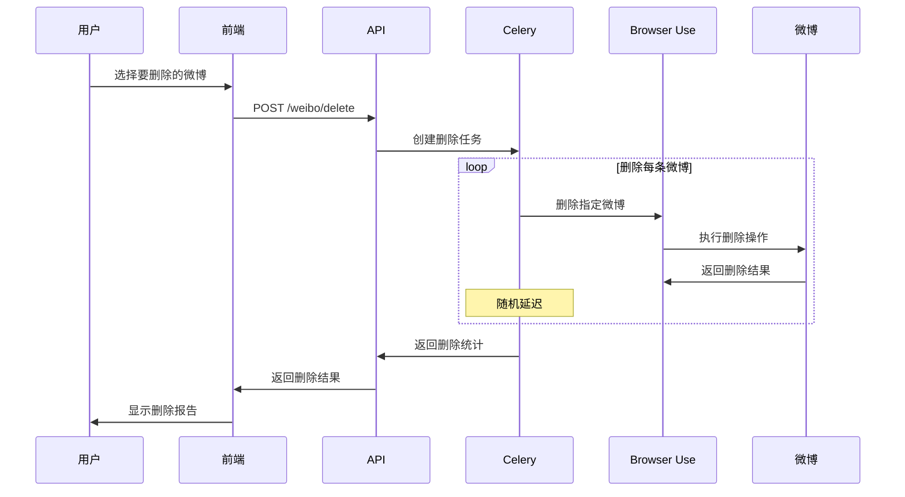

# 微博AI内容管理器 - 第二轮迭代实现文档

## 📋 项目概述

本项目是一个基于AI的微博内容智能管理工具，使用Browser Use + DeepSeek实现自动化微博内容分析和删除。第二轮迭代主要实现了真正的微博自动登录、内容获取、AI分析和批量删除功能。

## 🎯 核心功能实现

### 1. 微博自动登录 (WeiboAgent.login_weibo)

**技术实现**:
- 使用Browser Use框架进行浏览器自动化
- 支持用户名/密码登录
- 自动处理验证码识别
- 获取用户基本信息（昵称、粉丝数等）

**关键代码**:
```python
async def login_weibo(self, username: str, password: str, progress_callback: Optional[Callable[[str], None]] = None) -> Dict[str, Any]:
    login_prompt = f"""
    请帮我登录微博账号。
    登录信息：
    - 用户名：{username}
    - 密码：{password}
    
    请执行以下步骤：
    1. 打开微博登录页面 (https://weibo.com/login.php)
    2. 输入用户名和密码
    3. 处理可能出现的验证码
    4. 确认登录成功
    5. 获取用户基本信息（昵称、粉丝数等）
    """
    result = await self.execute_task(login_prompt, progress_callback)
    # 解析登录结果并更新状态
```

### 2. 微博内容获取 (WeiboAgent.get_user_weibos)

**技术实现**:
- 支持时间范围筛选
- 支持关键词过滤
- 可配置最大获取数量
- 提取完整微博信息（ID、内容、时间、互动数据等）

**关键代码**:
```python
async def get_user_weibos(self, start_date: Optional[str] = None, end_date: Optional[str] = None, keywords: Optional[List[str]] = None, max_count: int = 100) -> Dict[str, Any]:
    get_weibos_prompt = f"""
    请帮我获取我的微博列表。
    筛选条件：
    - 时间范围：{time_filter}
    - 关键词：{keyword_filter}
    - 最大数量：{max_count} 条
    
    对于每条微博，请提取以下信息：
    - 微博ID、发布时间、微博内容
    - 转发数、评论数、点赞数
    - 是否包含图片/视频、微博链接
    """
```

### 3. AI内容分析 (WeiboAgent._analyze_single_weibo)

**技术实现**:
- 使用DeepSeek AI进行内容风险评估
- 多维度风险分析（政治敏感、不当言论、隐私泄露等）
- 0-10分风险评分系统
- 提供具体风险原因和处理建议

**关键代码**:
```python
async def _analyze_single_weibo(self, weibo: Dict[str, Any]) -> Dict[str, Any]:
    analysis_prompt = f"""
    请分析以下微博内容的风险等级：
    微博内容：{content}
    发布时间：{publish_time}
    
    请从以下维度评估风险（0-10分，10分为最高风险）：
    1. 政治敏感内容
    2. 不当言论或争议性内容
    3. 过时信息或不准确信息
    4. 个人隐私泄露
    5. 商业推广或垃圾信息
    6. 负面情绪或抱怨
    7. 可能引起误解的内容
    """
```

### 4. 批量删除功能 (WeiboAgent.batch_delete_posts)

**技术实现**:
- 支持批量删除多条微博
- 随机延迟避免被检测
- 详细的删除结果记录
- 错误处理和重试机制

**关键代码**:
```python
async def delete_post(self, post_id: str) -> Dict[str, Any]:
    # 添加随机延迟
    delay = random.randint(settings.operation_delay_min, settings.operation_delay_max)
    await asyncio.sleep(delay)
    
    delete_prompt = f"""
    请帮我删除指定的微博。
    微博ID：{post_id}
    
    请执行以下步骤：
    1. 在我的微博页面找到ID为 {post_id} 的微博
    2. 点击微博右上角的"更多"按钮
    3. 选择"删除"选项
    4. 确认删除操作
    5. 验证删除是否成功
    """
```

## 🏗 架构设计

### 后端架构

```
backend/
├── app/
│   ├── agents/           # AI代理模块
│   │   ├── base_agent.py    # Browser Use基础代理
│   │   └── weibo_agent.py   # 微博专用代理
│   ├── api/              # API路由
│   │   └── v1/
│   │       └── weibo.py     # 微博管理API
│   ├── tasks/            # 异步任务
│   │   └── weibo_tasks.py   # 微博相关任务
│   ├── models/           # 数据模型
│   │   └── schemas.py       # Pydantic模型
│   ├── core/             # 核心配置
│   │   ├── config.py        # 应用配置
│   │   └── celery_app.py    # Celery配置
│   └── main.py           # FastAPI应用入口
```

### 前端架构

```
frontend/
├── src/
│   ├── pages/            # 页面组件
│   │   └── index.tsx        # 主页面
│   ├── services/         # API服务
│   │   └── api.ts           # API客户端
│   └── types/            # 类型定义
```

### 技术栈

**后端**:
- FastAPI: 高性能Web框架
- Celery: 异步任务队列
- Redis: 消息代理和结果存储
- Browser Use: 浏览器自动化框架
- DeepSeek: AI大语言模型
- Playwright: 浏览器控制引擎

**前端**:
- Next.js: React全栈框架
- Ant Design: 企业级UI组件库
- TypeScript: 类型安全的JavaScript

## 🔄 工作流程

### 1. 用户登录流程



### 2. 内容分析流程



### 3. 批量删除流程



## 🛡 安全特性

### 1. 操作频率限制
- 每小时最大删除数量限制
- 操作间随机延迟（2-10秒）
- 避免被平台检测为机器人

### 2. 数据安全
- 登录信息不存储
- API密钥环境变量管理
- JWT令牌认证（预留）

### 3. 错误处理
- 完善的异常捕获机制
- 任务失败重试
- 详细的错误日志记录

## 📊 性能优化

### 1. 异步处理
- 使用Celery进行异步任务处理
- 避免阻塞主线程
- 支持任务取消和状态查询

### 2. 资源管理
- 浏览器实例复用
- 连接池管理
- 内存使用优化

### 3. 缓存策略
- Redis缓存任务结果
- 减少重复计算
- 提高响应速度

## 🧪 测试策略

### 1. 单元测试
- 核心功能模块测试
- API端点测试
- 数据模型验证

### 2. 集成测试
- 端到端流程测试
- 浏览器自动化测试
- API集成测试

### 3. 性能测试
- 并发任务处理
- 内存使用监控
- 响应时间测试

## 🚀 部署方案

### 1. Docker容器化
- 多服务容器编排
- 环境隔离
- 一键部署

### 2. 开发环境
- 本地开发脚本
- 热重载支持
- 调试工具集成

### 3. 生产环境
- 负载均衡
- 监控告警
- 日志收集

## 📈 未来扩展

### 1. 功能扩展
- 支持更多社交平台
- 高级内容分析规则
- 批量操作优化

### 2. 技术升级
- 更先进的AI模型
- 更好的浏览器自动化
- 性能优化

### 3. 用户体验
- 移动端适配
- 更丰富的可视化
- 个性化设置

## 🔧 故障排除

### 常见问题及解决方案

1. **登录失败**
   - 检查网络连接
   - 验证用户名密码
   - 等待验证码自动处理

2. **分析任务卡住**
   - 检查Celery Worker状态
   - 验证Redis连接
   - 查看任务日志

3. **删除操作失败**
   - 确认登录状态
   - 检查微博权限
   - 验证微博ID有效性

4. **浏览器启动失败**
   - 安装Playwright浏览器
   - 检查系统依赖
   - 验证权限设置

## 📝 开发指南

### 环境搭建
1. 克隆项目代码
2. 配置环境变量
3. 安装依赖包
4. 启动开发服务

### 代码规范
- Python: PEP 8
- TypeScript: Airbnb
- 提交信息: Conventional Commits

### 调试技巧
- 使用日志记录
- 浏览器开发者工具
- API文档测试
- 单步调试

这个实现文档详细说明了第二轮迭代的核心功能、架构设计、工作流程和技术细节，为后续的开发和维护提供了完整的参考。 